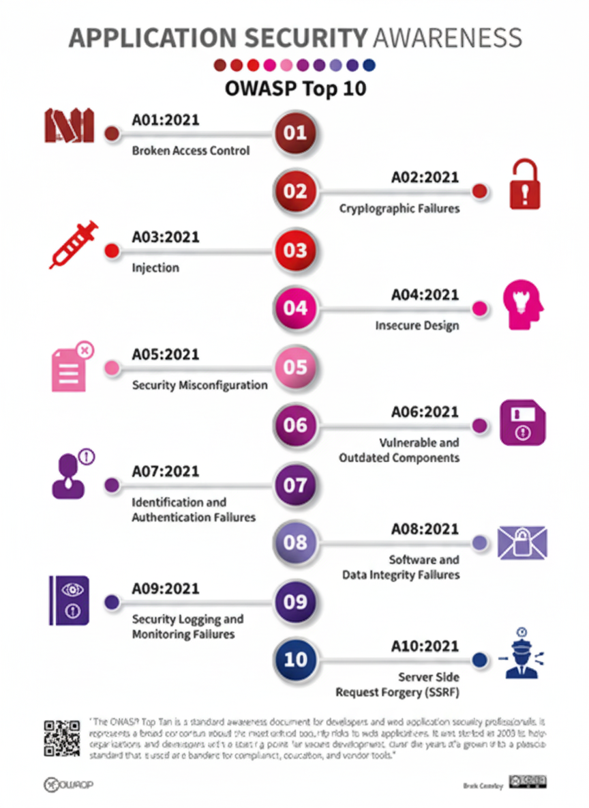

# 01: Introduction to Bug Bounty Hunting

## 🎯 Formation Goal
This formation is a complete guide to bug bounty hunting. The main goal is to cover the most common and critical vulnerabilities found in modern web applications.

---

## Bug Bounty vs. Penetration Testing
It is important to understand the key difference between these two fields:

* **Penetration Testing:** This is a formal engagement where a company hires you to test a specific application or network. It has a defined scope and a fixed timeline.
* **Bug Bounty Hunting:** This is a more open-ended process. You use your skills to find vulnerabilities in programs listed on platforms (like **HackerOne** or **Bugcrowd**) and get paid *per vulnerability*. It's not about a formal report; it's about finding bugs.

---

## 📚 Core Topics Covered
We will cover a wide range of attacks, with a special focus on the **OWASP Top 10 (2021)**, which is the industry standard for web application security.

---

## 🏁 Final Objective
At the end of this formation, we will apply all the skills, techniques, and methodologies we've learned to a **real, live target** to find our first bug.
