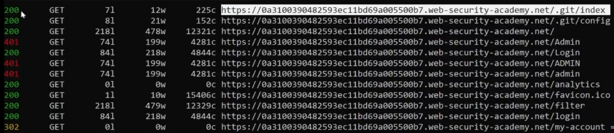
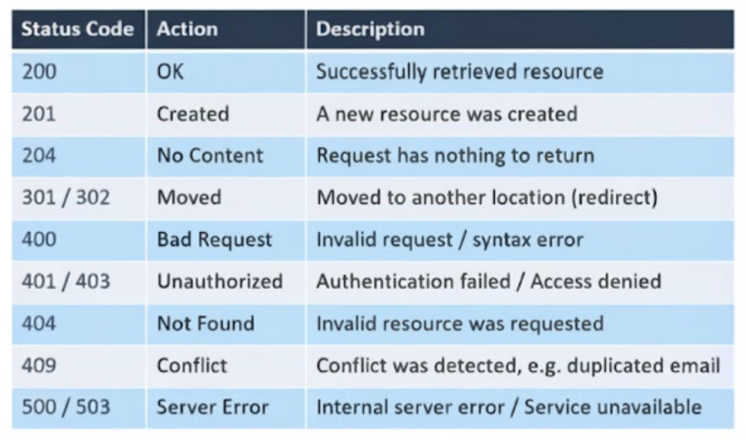

# HTTP Response Status Codes

In this lesson, we will learn about the HTTP status codes. You saw these when we used `feroxbuster`—it shows codes next to the paths it discovers.

Here is an image of the results from `feroxbuster`:

## Common Code Examples

* **200 (OK):** Means that your request is approved and was successful.
* **401 (Unauthorized):** Means your request is forbidden. This could be because you need to log in, or the server is simply blocking you.
* **302 (Found):** Means you are being redirected, like to a new page or location.

## Status Code Categories

All status codes are grouped into five main categories:

* **1XX (Informational):** The server received the request and is processing it.
* **2XX (Success):** The server successfully received and processed the request.
* **3XX (Redirection):** The server received the request, but there’s a redirect to another destination (common codes are `301` or `302`).
* **4XX (Client Error):** The requested resource couldn’t be found or reached due to a client-side error.
* **5XX (Server Error):** The server ran into an internal error when processing the request.

---

## Summary Table

Here is a summary image of the most common HTTP status codes:

